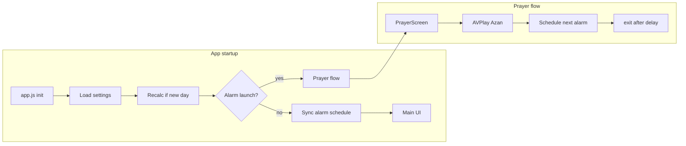

# Architecture – AzanTV

## Overview

AzanTV is a **Tizen 4.0 Web Application** (HTML/CSS/JS) for Samsung consumer Smart TVs. It calculates prayer times locally, schedules the next event with the **Tizen Alarm API**, plays Azan audio via **AVPlay**, and exits after playback.

An optional **Node.js companion** on the LAN sends **Wake-on-LAN** before prayer when the TV cannot wake itself from standby.

## Modules

| Module | File | Responsibility |
|--------|------|----------------|
| Bootstrap | `src/app.js` | Lifecycle, navigation, alarm launch handling |
| Storage | `src/storageService.js` | `localStorage` settings, alarm state, day key |
| Prayer times | `src/prayerTimeService.js` | adhan calculations, next prayer, countdown |
| Alarms | `src/alarmService.js` | `AlarmAbsolute`, AppControl payload, dedup |
| Audio | `src/audioService.js` | `webapis.avplay` open/prepare/play |
| TV behavior | `src/tvPowerService.js` | Screen saver, `exit()`, visibility |
| Test mode | `src/testModeService.js` | 30 s / 1 min test schedules |
| UI | `src/ui/*.js` | Main, settings, prayer screens |
| Vendor | `src/vendor/adhan.min.js` | Bundled adhan-js UMD |

## Data flow: scheduling

1. User saves settings or app starts normally
2. `PrayerTimeService.getNextPrayer()` finds next enabled prayer
3. `AlarmService.scheduleAt()` creates `AlarmAbsolute` + `ApplicationControl`
4. Payload JSON: `{ prayer, timestamp }` in `data` key `payload`
5. OS removes alarm after fire → app must schedule next on exit

Only **one** alarm is kept at a time to avoid duplicates.

## Data flow: alarm launch

1. Tizen starts app with requested AppControl
2. `AlarmService.parsePayloadFromLaunch()` reads prayer name
3. `PrayerScreen` shown, screen saver disabled
4. `AudioService.playAzan()` plays MP3 from app bundle path
5. On complete: `scheduleNextPrayer()` + `exit()` after `exitDelaySeconds`

## Settings schema

Stored under key `azantv_settings_v1`:

- Location: city preset or custom lat/lng/timezone
- `calculationMethod`: adhan method name
- `madhab`: `Shafi` or `Hanafi`
- `enabledPrayers`, `offsets`, `audioVariant`, `fajrAudio`, `volume`, `exitDelaySeconds`

Alarm state key `azantv_alarm_state_v1`: last alarm id, next prayer, ISO time.

## Companion architecture

| Component | Role |
|-----------|------|
| `adhan` (npm) | Same prayer math as TV app |
| `node-cron` | Daily replan at midnight |
| `wake_on_lan` | Magic packet to TV MAC |
| HTTP server | `/status`, `/trigger-test`, `/reload` |
| Optional fetch | Samsung REST launch on port 8001 |

Companion runs **outside** the TV; it does not modify Tizen internals.

## Tizen constraints reflected in design

- No background JS → no `setInterval` while hidden; alarms instead of timers
- No consumer power APIs → `exit()` not TV off
- AVPlay needs absolute paths → resolve via `appInfo.path`
- `AlarmRelative` avoided for exact prayer times (OS may round periods)

## Security & privacy

- All settings local on TV
- No analytics or cloud by default
- Optional Aladhan API disabled by default in settings schema
- Companion listens on LAN; bind/firewall appropriately

## Extension points

- Enable `useOnlineApi` in settings for Aladhan fallback
- Add city presets in `storageService.CITY_PRESETS`
- Add Azan variants in `assets/azan/` and settings UI
- Home Assistant: HTTP calls to companion `/trigger-test`
